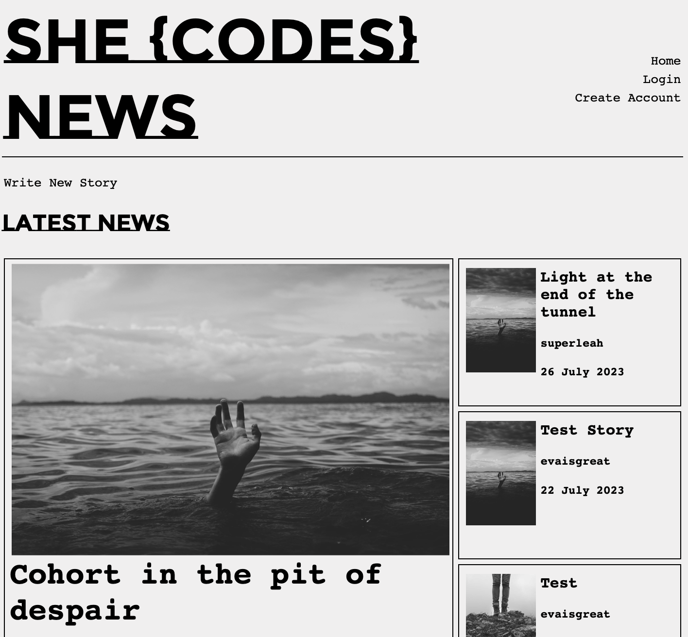
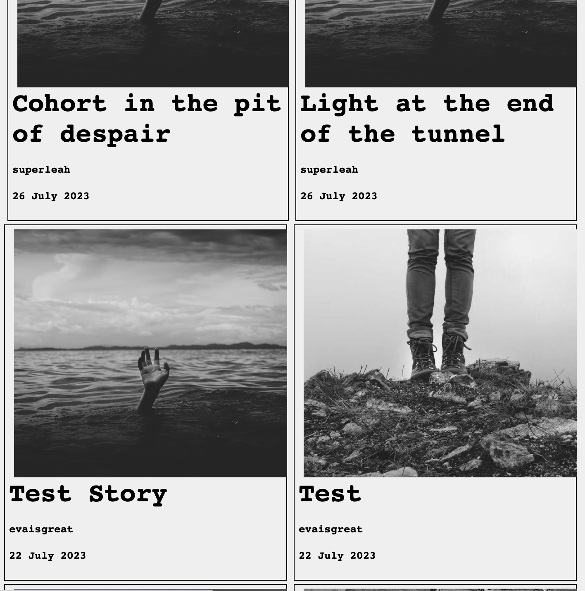
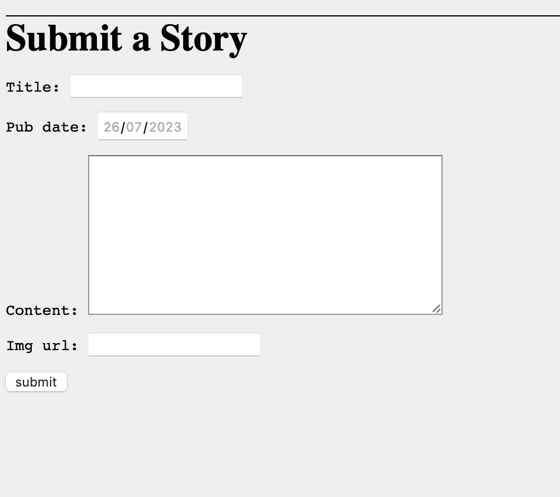
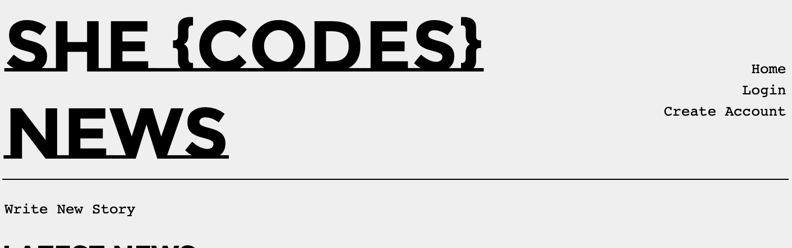
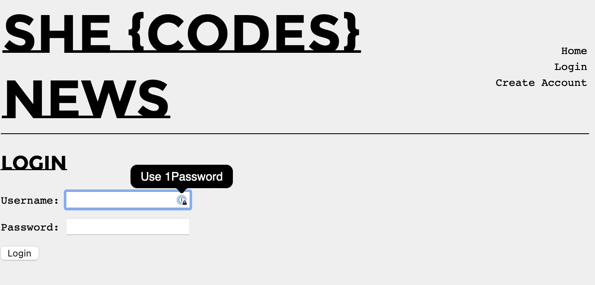
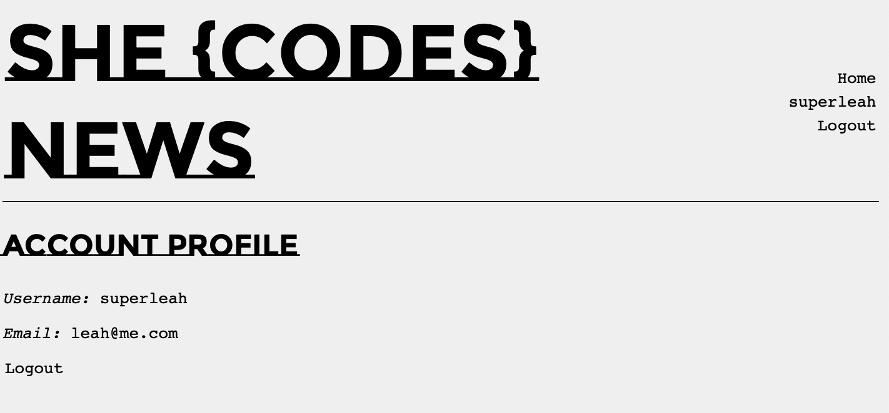
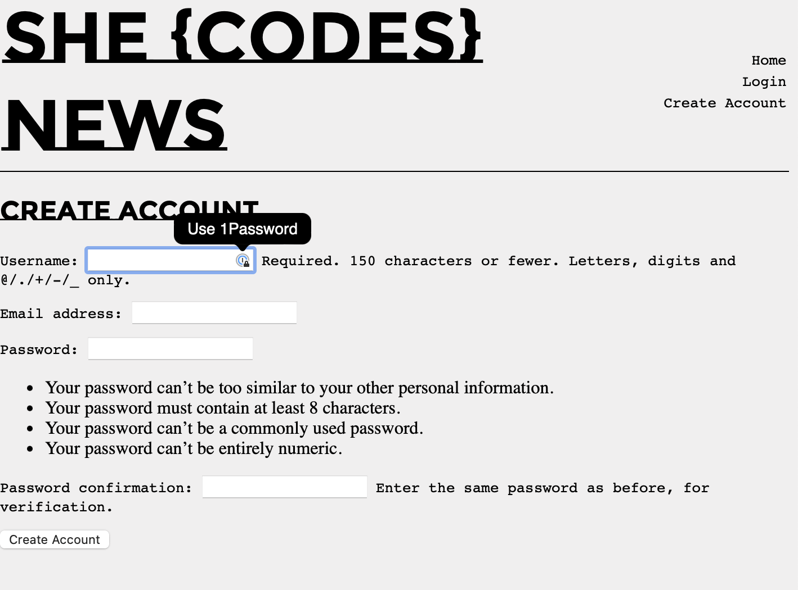
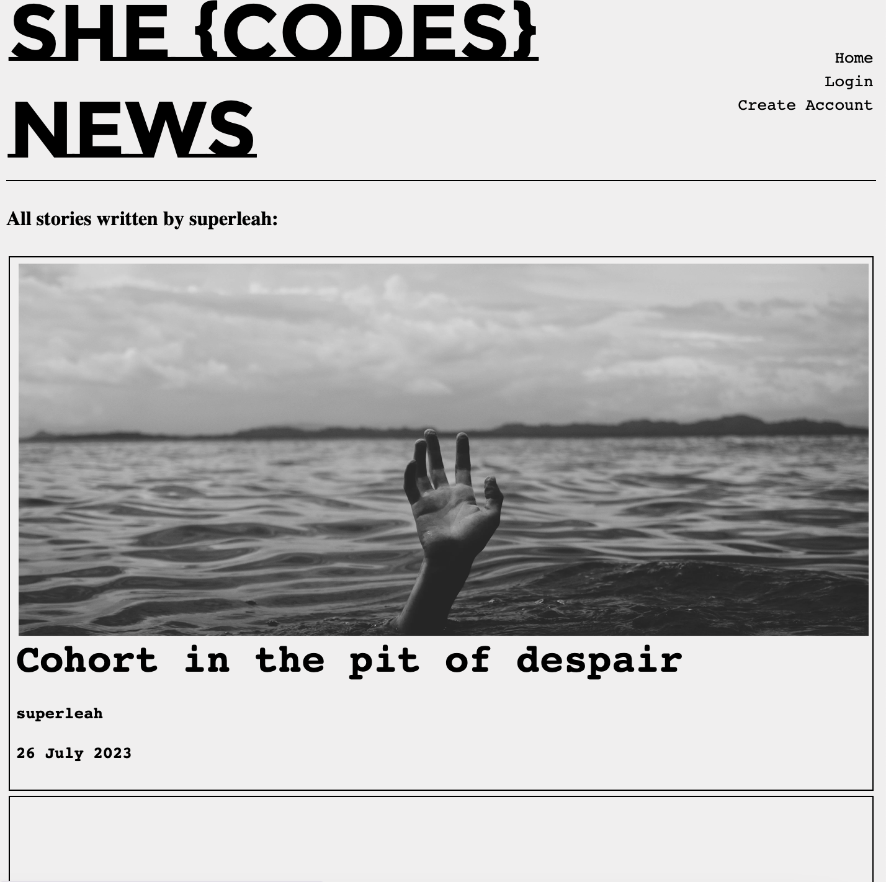
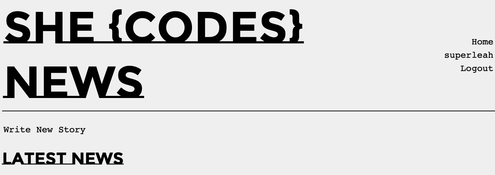
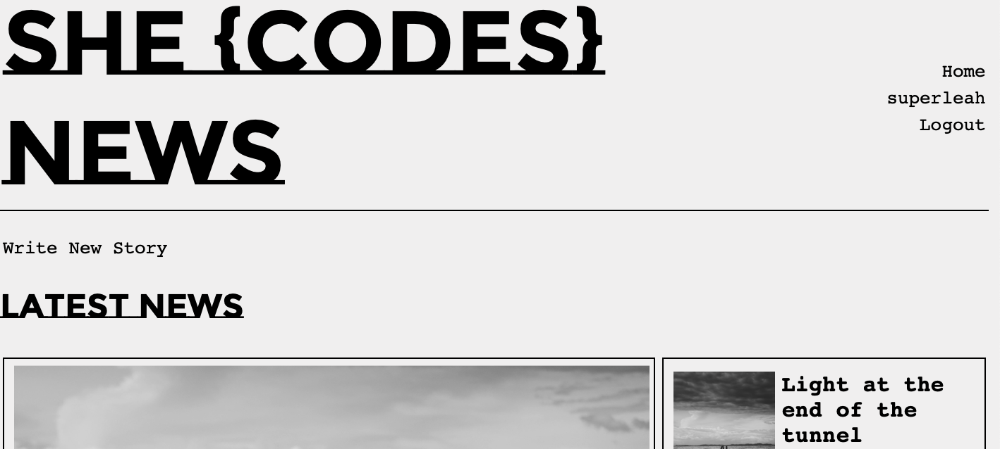

Questions:
- How give copy of db? 
### Please note this submission is incomplete. I was away for this module and catching up. I will refine functionality and add more detail in due course. 

# Leah Taylor - She Codes News Project

## About This Project

## How to Run this Code
1. Clone repo to your local machine
2. Set up virtual environment and install dependencies using requirements.txt
3. Migrate the database 
4. Run local server and navigate to localhost/news/

## Database Schema
- Followed the provided ERD, did not add to it. 

## Project Features
- [x] Order stories by date

- [x] Styled "new story" form

I did not style this but implemented the form

- [x] Story images
See screenshots

- [x] Log-in / log-out

- [x] Account View page

- [x] Create Account page

- [x] View stories by author

(screenshots/storiesByAuthor.png)

- [x] Log-in only visible when no user logged in/ logout only visible when user is logged in

- [x] Create Story functionality only available when user logged in 
